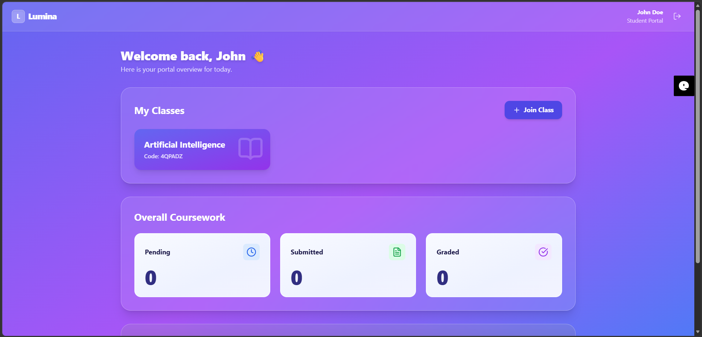
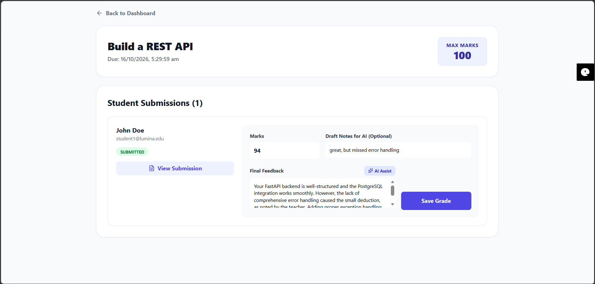
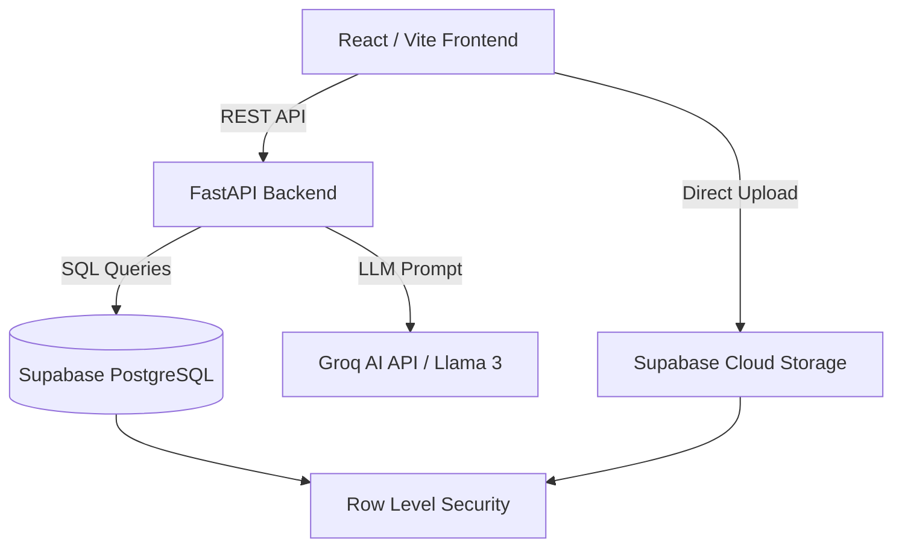

**Note: The frontend UI is currently undergoing a responsive redesign, but the FastAPI backend and database architecture are fully deployed.**

# Lumina Cloud LMS 🚀

A modern, cloud-native Learning Management System designed to streamline assignment workflows, secure file submissions, and assist educators with AI-generated grading feedback.

## 🌟 Key Features
- **Role-Based Workflows:** Distinct, secure environments for Students and Teachers.
- **Smart Enrollment:** Google Classroom-style 6-character course joining.
- **Inline Grading Portal:** Native browser rendering for PDFs and DOCX files to eliminate download fatigue.
- **AI Feedback Assistant:** Integrated Groq Cloud API (Llama 3) to generate contextualized, constructive grading feedback.
- **Secure Cloud Storage:** Supabase Object Storage secured with Row-Level Security (RLS) policies.

## 📸 System Previews

| Student Dashboard | Teacher Grading Portal |
|:---:|:---:|
|  |  |

## 🏗️ Cloud Architecture

## 🛠️ Technology Stack

Frontend: React, Vite, Tailwind CSS, Lucide Icons, React Router

Backend: Python, FastAPI, Uvicorn, Pydantic

Database & Storage: Supabase (PostgreSQL, Object Storage)

AI Integration: Groq API (openai/gpt-oss-20b)

## 🚀 Local Development Setup

**Prerequisites**

Node.js (v18+)

Python (3.10+)

Supabase Project & Groq API Key

**Backend Setup**

cd backend

python -m venv venv

source venv/Scripts/activate (Windows)

pip install -r requirements.txt

Set .env variables (SUPABASE_URL, SUPABASE_KEY, GROQ_API_KEY)

uvicorn main:app --reload

**Frontend Setup**

cd frontend

npm install

Set .env variables (VITE_SUPABASE_URL, VITE_SUPABASE_ANON_KEY)

npm run dev

## 👩‍💻 Author

**Shravani Mane**  
*CSE-AIML Student | Cloud Computing & AI Developer*

Built as a comprehensive personal project to demonstrate full-stack cloud architecture, secure API integration, and practical application of large language models. 

